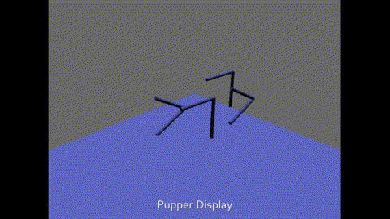

# Stanford Pupper Reinforcement Learning Policy Initializer

This fork of StanfordQuadruped focuses on learning a starting policy for a reinforcement learning agent (currently using OgmaNeo2) made to run on the Pupper robot.
The agent learns to replicate the existing kinematic model in the original repository. After that, it can be trained further IRL, using an optical flow sensor to get a reward signal, and taking IMU readings into account.

Note that most hardware-related code has been removed - this version is meant solely to serve as a kinematic model -> RL agent "copy operation". It doesn't require an actual robot and can be run on a regular PC.

## Display

There is now an (approximate) policy display for the robot. It uses Panda3D, so that needs to be installed in order to use it.

Poorly editted/looped gif:

